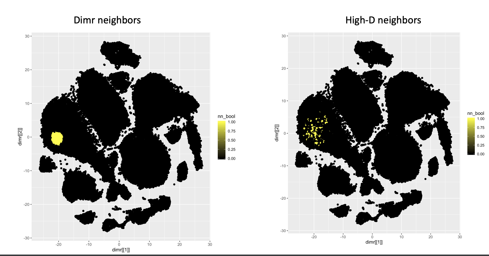

## Introduction, the problem
This project provides a wrapper to the sleepwalk R package, which can be found [here](https://anders-biostat.github.io/sleepwalk/). 

The motivation for this wrapper comes from previous work I've done on the quality of dimension reduction embeddings for cytometry data, which you can view [here](https://tjburns08.github.io/tjb_dimr_talk.pdf). Simply put, some users in the cytometry field like to gate or cluster directly on the embeddings. This re-working of sleepwalk allows these users to gain additional intuition around whether this is a good idea for the data in question and/or a particular cell subset.  

In the image below, notice that the k-nearest neighbors of a given cell in the embedding space (left) is very different than the k-nearest neighbors of the same cell in the original feature space. If you want to gate or cluster directly on the embedding, these visualizations are critical to understanding how small to partition, if at all. 

## Description
Sleepwalk allows one to interact with a low-dimensional embedding of a high-dimensional dataset, often generated when doing high-dimensional cytometry or single cell sequencing analysis. Specifically, the embedding map is displayed, and the user places the cursor over a given cell in the map. The neighboring cells are colored by the distance between each cell and the original cell in feature space, which is going to be different than the same distance in the embedding space. 

My wrapper allows for the visualization of a given cell's K-nearest neighbors. In other words, the cursor is on a given cell, and the cells on the map that change color correspond to a pre-specified number of nearest neighbors in the original high-dimensional space. 

## How to use
1. Install the sleepwalk package from CRAN. 
2. Look at the example I provide in notebooks/ to get your data into the proper format, and run the wrapper.

When you run sleepwalk, a browser window will open up with the interactive embedding. The more cells you have, the longer it will take for the map to show up in the browser window. In my experience, 10000 cells with a k of 100 gives you the intuition you need. Note also that the console will say "server has been stopped." That doesn't mean that the tool failed. In my experience, the interactive map works just fine despite this message. You can see an example of the output below.

